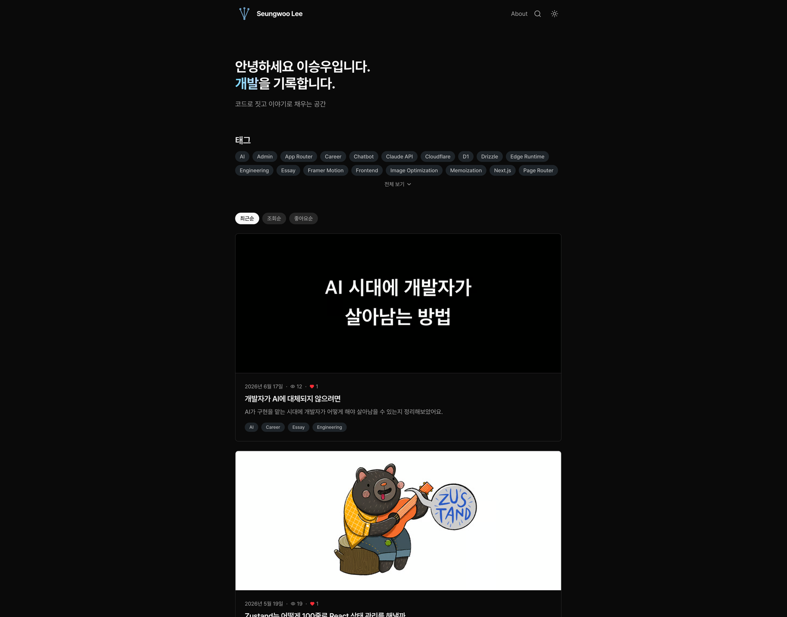
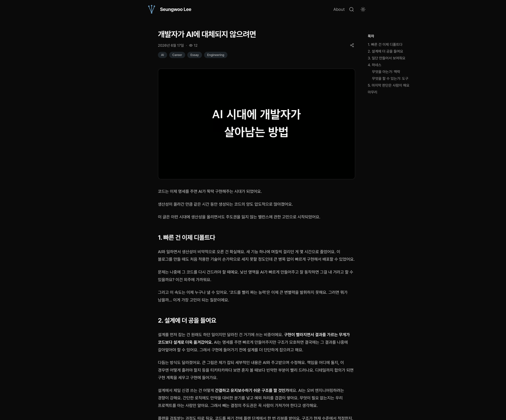
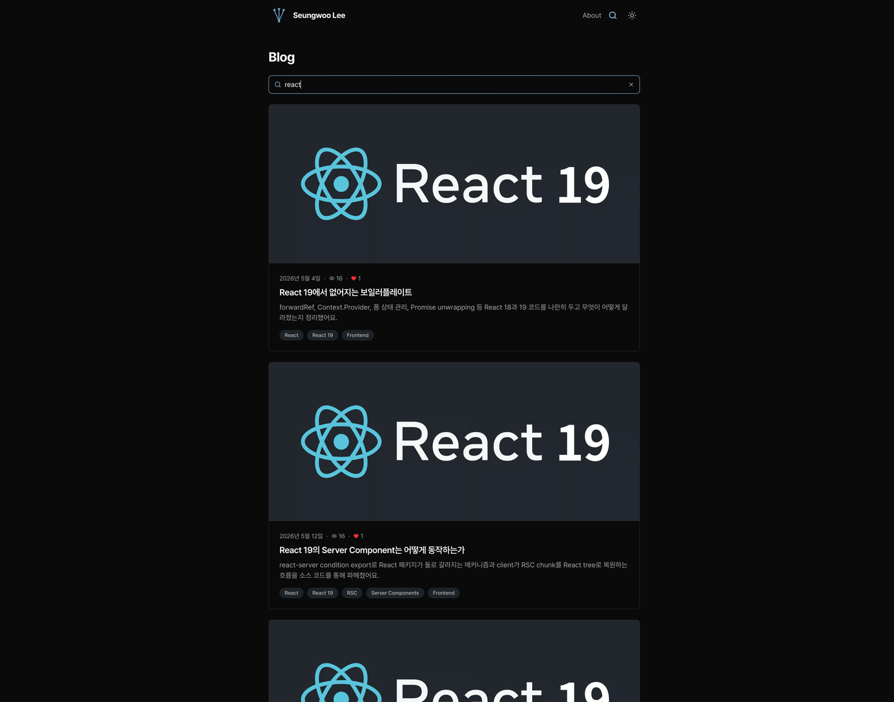
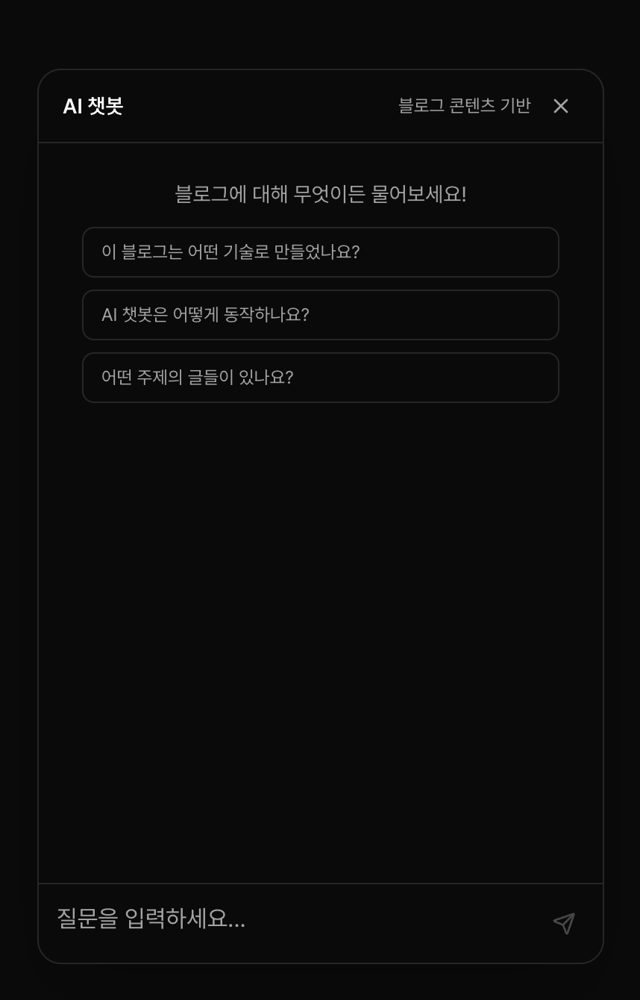
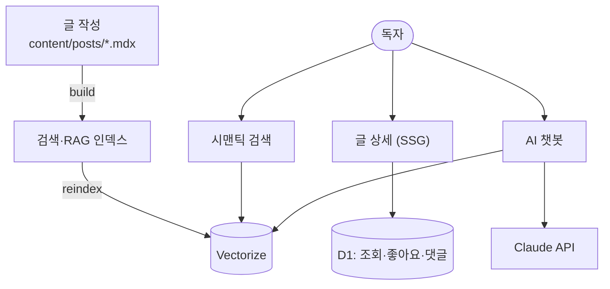

<div align="center">


# Seungwoo Lee · Blog

개발 · 여행 · 일상을 기록하는 개인 블로그.
MDX로 글을 쓰고, 블로그 내용을 학습한 **AI 챗봇**에게 물어볼 수 있습니다.

[](https://www.seung-woo.me/)
[](https://nextjs.org/)
[](https://www.typescriptlang.org/)
[](https://tailwindcss.com/)
[](https://pages.cloudflare.com/)

</div>

---

## ✨ 주요 기능

| 기능 | 설명 |
|------|------|
| 📝 **MDX 블로그** | 코드 하이라이팅, 자동 목차, 이미지 줌, 시리즈 네비게이션 |
| 🤖 **AI 챗봇** | 블로그 글을 RAG로 학습해 출처와 함께 답변 (문단 단위 페이드인) |
| 🔍 **시맨틱 검색** | Workers AI 임베딩 + Vectorize, 키워드와 의미 검색 결합 |
| 🏷️ **태그 아카이브** | 태그별 글 모아보기, 태그 간 이동 |
| 📊 **정렬** | 최근순 · 조회순 · 좋아요순 (URL에 상태 저장) |
| 💬 **댓글** | 대댓글, 멘션, 좋아요 |
| 🌗 **다크 모드** | 시스템 설정 연동 |
| 🖼️ **미디어 어드민** | R2 업로드, 폴더 탐색, DnD 정렬, 멀티 선택 삭제 |
| ⚡ **SEO** | OpenGraph, sitemap, RSS, JSON-LD(BlogPosting·BreadcrumbList) |

## 📸 스크린샷

<table>
  <tr>
    <td align="center" width="50%"><br><sub><b>홈</b></sub></td>
    <td align="center" width="50%"><br><sub><b>글 상세</b></sub></td>
  </tr>
  <tr>
    <td align="center"><br><sub><b>시맨틱 검색</b></sub></td>
    <td align="center"><br><sub><b>AI 챗봇</b></sub></td>
  </tr>
</table>

## 🛠️ 기술 스택

- **Framework** — Next.js 15 (App Router, Server Components)
- **Content** — MDX (next-mdx-remote, rehype-pretty-code/shiki)
- **Styling** — Tailwind CSS v4, Framer Motion
- **AI** — Claude API + Cloudflare Workers AI (bge-m3) + Vectorize (RAG)
- **Data** — Cloudflare D1 (Drizzle ORM), R2 (미디어)
- **Deploy** — Cloudflare Pages (@cloudflare/next-on-pages)

## 🏗️ 아키텍처



구조·시스템·주요 파일 위치는 [ARCHITECTURE.md](ARCHITECTURE.md)에 정리돼 있습니다.

## 🚀 시작하기

```bash
pnpm install
pnpm dev          # predev가 검색·RAG 인덱스를 자동 생성
```

빌드 / 배포:

```bash
pnpm verify       # lint + typecheck + test + mdx alt 검사
pnpm build
wrangler pages deploy
```

## 📁 프로젝트 구조

```
content/posts/          # MDX 블로그 글 (콘텐츠의 단일 원천)
src/
├── app/
│   ├── blog/           # 글 목록 · 상세 · 태그 아카이브
│   ├── admin/          # 미디어 관리 어드민
│   └── api/            # views · likes · comments · chat · search · media
├── components/         # home · blog · chat · mdx · layout · motion
├── lib/                # MDX 파싱, D1, 이미지, RAG, 인증
├── hooks/              # useChat, useDebounce 등
└── types/
scripts/                # 검색·RAG 인덱스, codebase-summary, alt 검사
```
