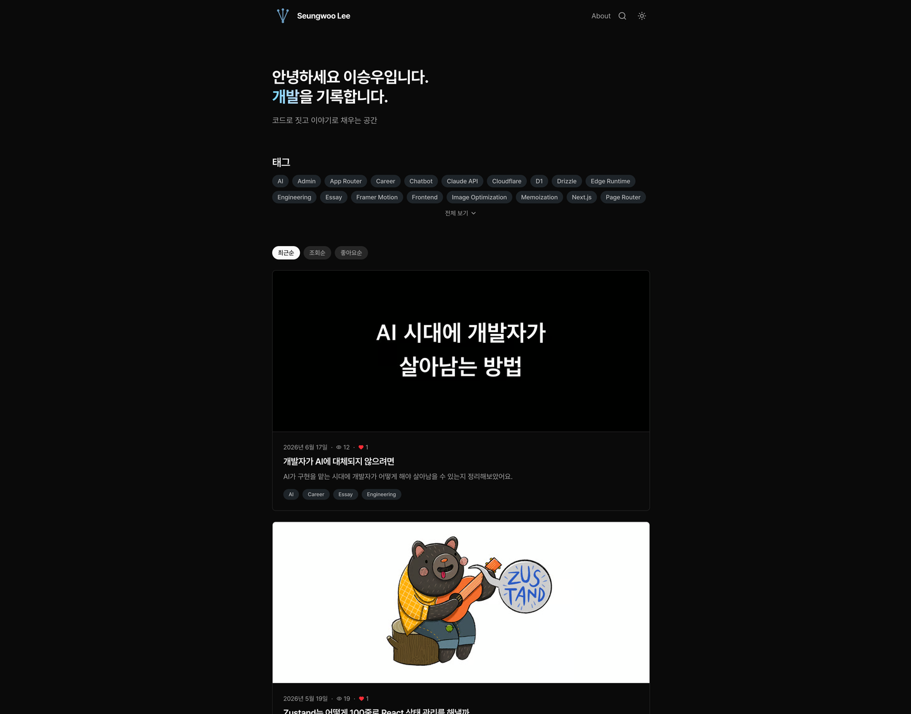
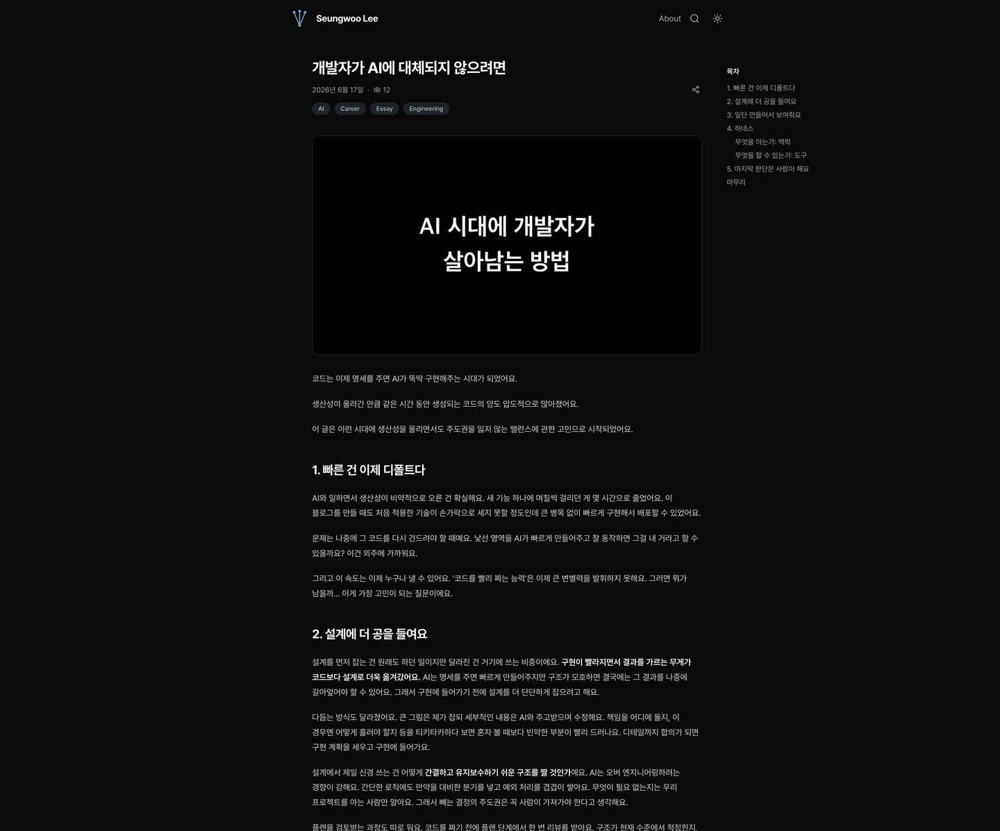
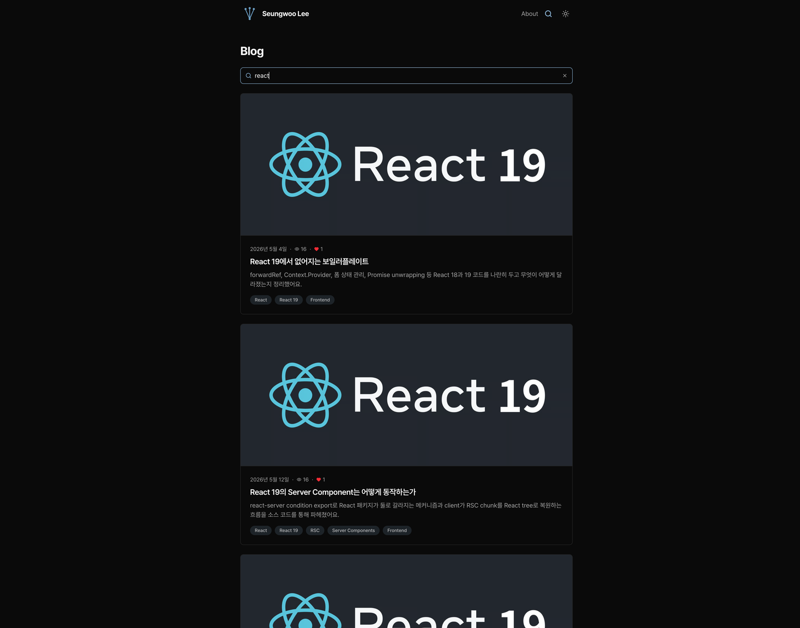
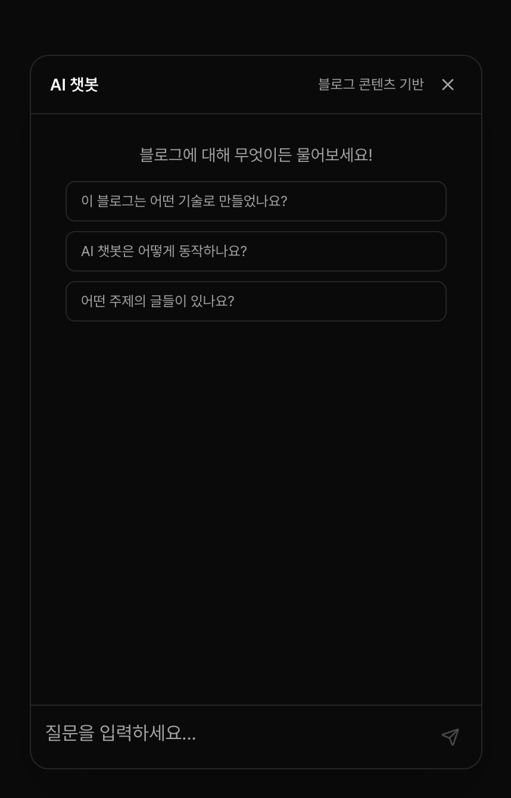

# Seungwoo Lee · Blog

개발하며 배운 것과 여행, 일상을 기록하는 개인 블로그예요. 글은 MDX로 작성하고 Cloudflare Workers에서 운영하고 있어요.

[블로그 방문하기](https://www.seung-woo.me/)

## 화면과 기능

홈에서 최근 글과 주간 인기 글을 살펴보거나 태그별로 글을 모아볼 수 있어요. 글에는 목차와 시리즈 이동, 이미지 확대, 댓글과 좋아요를 붙였어요. 라이트 모드와 다크 모드를 모두 지원해요.

검색은 키워드가 일치하는 글과 의미가 가까운 글을 함께 찾아줘요. 챗봇에 질문하면 관련 글을 찾아 답변에 참고하고, 답변 아래에 해당 글의 링크를 보여줘요.

<table>
  <tr>
    <td align="center" width="50%"><br>홈</td>
    <td align="center" width="50%"><br>글 상세</td>
  </tr>
  <tr>
    <td align="center"><br>검색</td>
    <td align="center"><br>AI 챗봇</td>
  </tr>
</table>

## 구현

Next.js 16 App Router, React 19, TypeScript를 사용해요. 스타일은 Tailwind CSS v4로 작성하고 애니메이션에는 Framer Motion을 써요. OpenNext를 통해 Cloudflare Workers에 배포해요.

글 페이지는 MDX 파일을 읽어 빌드할 때 정적으로 생성해요. `next-mdx-remote`로 본문을 렌더링하고 Shiki로 코드에 색을 입혀요. 조회수, 좋아요, 댓글은 Drizzle ORM을 통해 D1에 저장하고 이미지와 동영상은 R2에 보관해요. 미디어 업로드와 폴더 관리는 `/admin`에서 할 수 있어요.

검색과 챗봇에는 Workers AI의 `bge-m3` 임베딩과 Vectorize를 사용해요. 검색은 글 단위로, 챗봇은 글을 나눈 청크 단위로 별도 인덱스를 유지해요. 챗봇은 질문과 관련된 청크를 찾은 뒤 Claude API에 함께 전달하는 RAG 방식이에요.

## 로컬에서 실행하기

CI와 같은 Node.js 22와 `package.json`의 `packageManager`에 지정된 pnpm을 사용해요.

```bash
pnpm install --frozen-lockfile
```

Cloudflare 바인딩은 [wrangler.worker.jsonc](wrangler.worker.jsonc)에 있어요. 별도 계정에서 실행한다면 D1, R2, Vectorize 설정을 본인 리소스에 맞춰야 해요.

챗봇의 `ANTHROPIC_API_KEY`, 관리자의 `ADMIN_PASSWORD`, 웹 푸시의 `VAPID_PRIVATE_KEY`와 `VAPID_SUBJECT`는 로컬 `.dev.vars`에 설정해요. 여행기의 지도에는 `.env.local`의 `NEXT_PUBLIC_GOOGLE_MAPS_API_KEY`와 `NEXT_PUBLIC_NAVER_MAP_CLIENT_ID`를 사용해요.

```bash
pnpm exec wrangler d1 migrations apply DB --local --config wrangler.worker.jsonc
pnpm dev
```

개발 서버를 시작하면 검색·RAG 데이터와 코드베이스 요약, 파비콘이 자동으로 생성돼요. Workers AI는 로컬 실행에서도 원격 리소스를 사용해요.

수정 후에는 아래 명령으로 ESLint, 타입 검사, 테스트와 MDX 이미지의 alt 누락 여부를 확인해요.

```bash
pnpm verify
```

## 글과 코드 위치

글은 `content/posts/<slug>.mdx`에 작성해요. 파일명이 글 주소가 되고 `published: true`인 글이 공개돼요. 제목, 설명, 날짜, 태그 등 frontmatter 항목은 [PostFrontmatter](src/types/index.ts)에서 확인할 수 있어요.

```
content/posts/          # 블로그 글
src/
├── app/                # 페이지와 API 라우트
├── components/         # 화면·MDX 컴포넌트
├── lib/                # 콘텐츠 파싱, API 구현, 검색·RAG 로직
├── hooks/              # 챗봇·좋아요 등 클라이언트 상태
└── worker.ts           # Workers 요청 처리
scripts/                # 빌드, 배포 검증, 주간 방문 리포트
drizzle/migrations/     # D1 마이그레이션
docs/                   # 운영 기록과 설계 문서
```

기능별 데이터 흐름과 수정할 파일은 [ARCHITECTURE.md](ARCHITECTURE.md)에 정리해 뒀어요.

## 빌드와 배포

Workers 환경에서 확인하려면 OpenNext로 빌드한 뒤 로컬 프리뷰를 실행해요. `workers:check`는 업로드 없이 번들과 Workers Free 용량 제한을 검사해요.

```bash
pnpm workers:build
pnpm workers:check
pnpm workers:preview
```

운영 배포는 `main`에 푸시하면 [Deploy Workers](.github/workflows/deploy-workers.yml)가 처리해요. 검증과 운영 빌드가 통과하면 배포하고, 실제 릴리스를 확인한 뒤 검색·RAG 입력이 바뀐 경우 재인덱싱해요. 이 워크플로는 저장소 변수 `WORKERS_PRODUCTION_ENABLED=true`일 때 실행돼요.

Workers 전환 과정과 복구 절차는 [운영 전환 기록](docs/next16-workers-cutover.md), OpenNext를 선택한 이유와 vinext 재검토 기준은 [마이그레이션 검증 기록](docs/next16-workers-progress.md#opennext-유지와-vinext-재검토-기준)에 남겨뒀어요.
